# VidGenie - Sistema de Agentes para Producción Automatizada de Videos Históricos


VidGenie es un sistema avanzado de agentes especializados construido con **Claude Code** que automatiza la producción completa de videos educativos históricos para canales de YouTube, TikTok e Instagram. Transforma temas históricos en contenido multimedia atractivo siguiendo un pipeline de producción profesional.

## 🎯 Visión General

### Canales Soportados
- **HistoriasDeAsia** - Narrativas históricas del continente asiático  
- **HistoriasDeAmérica** - Relatos de la historia americana
- **HistoriasDeEuropa** - Crónicas del continente europeo
- **HistoriasDeÁfrica** - Narrativas del continente africano
- **HistoriasDeOceanía** - Relatos de Oceanía

### Formato de Contenido
- **🎙️ Audio**: Podcast conversacional entre 2 locutores IA
- **🎬 Visual**: Imágenes históricas, mapas, ilustraciones sincronizadas
- **⏱️ Duración**: 5-15 minutos por episodio
- **📱 Multiplataforma**: YouTube (16:9), TikTok (9:16), Instagram (1:1)

## 🏗️ Arquitectura del Sistema

### Agentes Especializados

| Agente | Función | Herramientas |
|--------|---------|-------------|
| 🔍 **research-agent** | Investigación histórica profunda | WebSearch, WebFetch, Read, Write |
| ✍️ **script-writer** | Guiones narrativos conversacionales | Read, Write, Bash, Grep |
| 🎨 **visual-planner** | Storyboard y planificación visual | Read, Write, Bash |
| 🎯 **media-hunter** | Búsqueda y curación de recursos multimedia | WebSearch, WebFetch, Bash |
| 🎤 **voice-generator** | Generación de prompts JSON para voces | Read, Write, Bash |
| 🎬 **video-composer** | Ensamblaje y renderizado final | Bash, Read, Write, Glob |

### Pipeline de Producción

```mermaid
flowchart LR
    A[👤 Usuario] --> B[🎬 /create-episode]
    B --> C[🔍 research-agent]
    C --> D[✍️ script-writer] 
    D --> E[🎨 visual-planner]
    E --> F[🎯 media-hunter]
    F --> G[🎤 voice-generator]
    G --> H[🎬 video-composer]
    H --> I[📱 Videos Finales]
```



## 🚀 Instalación Rápida

### Prerequisitos
- **Claude Code**: Versión más reciente instalada
- **FFmpeg**: Para procesamiento de video
- **Python**: 3.11+ para scripts de soporte

### Setup en 3 Pasos

1. **Clonar el repositorio**
```bash
git clone https://github.com/tu-usuario/vidgenie.git
cd vidgenie
```

2. **¡Listo para usar!**
No requiere configuración adicional de APIs externas.

3. **¡Listo para usar!**
```bash
# En Claude Code
/create-episode "Lautaro, el estratega mapuche" --serie "Mapuches" --canal "HistoriasDeAmerica"
```

## 📖 Guía de Uso

### Comando Principal

El comando `/create-episode` inicia todo el pipeline automatizado:

```bash
# Sintaxis básica
/create-episode "[título del episodio]"

# Con parámetros opcionales
/create-episode "[título]" --serie "[nombre serie]" --canal "[canal destino]" --duracion [minutos]

# Ejemplos
/create-episode "Miyamoto Musashi y el camino del samurái" --serie "Samurais Legendarios" --canal "HistoriasDeAsia"
/create-episode "La caída de Tenochtitlan" --serie "Imperio Azteca" --canal "HistoriasDeAmerica" --duracion 12
```

### Output Style Especializado

Activa el modo documentalista para mejores resultados:

```bash
/output-style documentary-producer
```

### Gestión de Agentes

```bash
# Ver todos los agentes disponibles
/agents

# Invocar agente específico
> Usa el research-agent para investigar la Guerra del Pacífico
> Solicita al script-writer que mejore el diálogo del Acto 2
```

## 📁 Estructura del Proyecto

```
vidgenie/
├── 📋 plan-vidgenie-agent.md          # Especificaciones completas del sistema
│
├── .claude/
│   ├── agents/                       # Agentes especializados
│   │   ├── research-agent.md
│   │   ├── script-writer.md
│   │   ├── visual-planner.md
│   │   ├── media-hunter.md
│   │   ├── voice-generator.md
│   │   └── video-composer.md
│   ├── commands/
│   │   └── create-episode.md         # Comando principal
│   └── settings.json                 # Configuración MCP y hooks
│
├── output-styles/
│   └── documentary-producer.md       # Modo especializado
│
├── templates/                        # Plantillas y configuraciones
├── assets/                          # Recursos del sistema
├── generated/                       # Episodios generados
└── utils/                           # Scripts de utilidad
```

## 🎬 Flujo de Trabajo Típico

### ⏱️ Tiempo Total: ~45 minutos por episodio

1. **🔍 Investigación** (8-12 min)
   - Búsqueda en fuentes académicas confiables
   - Verificación cruzada de datos históricos
   - Generación de cronología y contexto

2. **✍️ Guionización** (5-8 min)
   - Transformación en narrativa conversacional
   - Estructura de 3 actos con ganchos dramáticos
   - Diálogos naturales entre locutores

3. **🎨 Planificación Visual** (3-5 min)
   - Storyboard sincronizado con audio
   - Mapeo de recursos multimedia necesarios
   - Timing exacto para transiciones

4. **🎯 Recolección de Medios** (10-15 min)
   - Búsqueda automatizada en repositorios
   - Descarga y organización de recursos
   - Generación de contenido faltante con IA

5. **🎤 Generación de Audio** (4-6 min)
   - Prompts JSON para generar voces diferenciadas
   - Aplicación de pausas y énfasis
   - Exportación en calidad broadcast

6. **🎬 Composición Final** (8-12 min)
   - Ensamblaje sincronizado de elementos
   - Renderizado en múltiples formatos
   - Generación de subtítulos automáticos

## 🎯 Ejemplos de Episodios

### Serie: Mapuches (HistoriasDeAmerica)
- ✅ "Lautaro: El estratega que desafió a un imperio"
- 🔄 "Caupolicán: El toqui que unificó a los clanes"
- ⏳ "Janequeo: La mujer que lideró la resistencia"

### Serie: Samurais Legendarios (HistoriasDeAsia)
- ⏳ "Miyamoto Musashi y el camino del samurái"
- ⏳ "Oda Nobunaga: El demonio del sexto cielo"
- ⏳ "Los 47 ronin: Honor hasta la muerte"

## ⚙️ Configuración Avanzada

### Variables de Entorno
```bash
# .env
ANTHROPIC_API_KEY=opcional_para_validation
```

### Personalización de Locutores
Edita `templates/voice-profiles/narrator-profiles.json`:
```json
{
  "locutor_a_maria": {
    "voice_id": "female_voice_1",
    "characteristics": {
      "tone": "warm_professional",
      "pace": "measured", 
      "emotion": "controlled_dramatic"
    }
  }
}
```

### Hooks Personalizados
El sistema incluye hooks para validación y logging automático:
- ✅ Pre-research validation
- ✅ Post-media processing  
- ✅ Quality check automático

## 📊 Métricas de Éxito

### Calidad del Contenido
- **Precisión histórica**: >95% de datos verificados
- **Engagement narrativo**: Estructura 3 actos completa
- **Calidad técnica**: Audio/video sin errores

### Eficiencia de Producción  
- **Tiempo total**: <60 minutos por episodio
- **Intervención manual**: <10% del proceso
- **Tasa de éxito**: >90% episodios sin errores

### Escalabilidad
- **Producción**: 3-5 episodios por día
- **Canales simultáneos**: 5+ canales soportados
- **Series paralelas**: 10+ series activas

## 🛠️ Solución de Problemas

### Errores Comunes


**❌ "Research agent no encuentra fuentes"**
```bash
# Verificar conexión a internet
# Intentar términos de búsqueda alternativos
# Revisar filtros de WebSearch
```

**❌ "Video rendering falla"**
```bash
# Verificar instalación de FFmpeg
# Comprobar permisos de escritura en carpeta generated/
# Revisar disponibilidad de recursos multimedia
```

### Logs y Debugging
```bash
# Activar modo debug
claude --debug

# Verificar logs de hooks
cat ~/.claude/logs/hooks.log

# Revisar estado de MCP
/create-episode "Tu episodio de prueba" --canal "TuCanal"
```

## 🤝 Contribución

### Agregar Nuevas Series
1. Crear directorio en `generated/episodes/[canal]/[nueva-serie]/`
2. Añadir a la lista de series en el plan principal
3. Configurar templates específicos si es necesario

### Expandir Capacidades
- **Nuevos idiomas**: Configurar voice profiles adicionales
- **Formatos alternativos**: Podcast solo-audio, clips cortos
- **Integraciones**: YouTube API, analytics automáticos

## 📞 Soporte y Comunidad

- **📚 Documentación**: Revisar `plan-vidgenie-agent.md` para detalles completos
- **💬 Issues**: Reportar problemas en GitHub Issues
- **📧 Contacto**: [tu-email@domain.com]

## 🎉 Próximas Características

### En Desarrollo
- [ ] 🌍 **Multi-idioma**: Episodios en inglés, portugués, francés
- [ ] 📱 **Integración directa**: Upload automático a YouTube/TikTok
- [ ] 🎨 **Thumbnails IA**: Generación automática de miniaturas
- [ ] 📊 **Analytics**: Dashboard de métricas de producción

### Roadmap Q1 2024
- [ ] 🎮 **Serie Gaming**: Historia de los videojuegos
- [ ] 🏛️ **Serie Arquitectura**: Grandes construcciones históricas  
- [ ] 🎭 **Serie Cultura**: Arte, música y literatura por épocas
- [ ] 🚀 **Serie Ciencia**: Grandes descubrimientos científicos

---

## 📄 Licencia

MIT License - Desarrollado con ❤️ usando Claude Code

**¡Transforma la historia en contenido viral con VidGenie! 🎬✨**

---

*Para comenzar inmediatamente, ejecuta:*
```bash
/create-episode "Tu primer episodio histórico" --serie "Tu Serie" --canal "TuCanal"
```